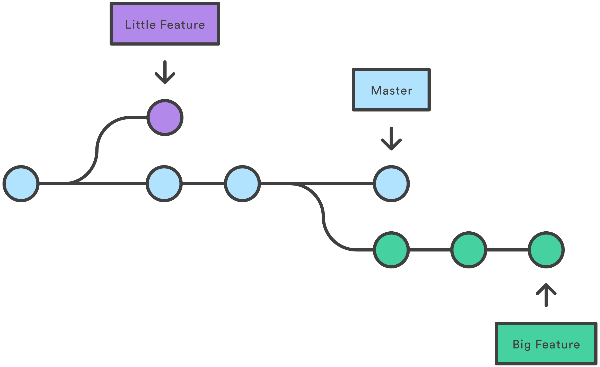

## Git

>   In this module, we will learn a little bit about version control system, Git, the problem its solved and the neccesary things to aid our learning and usage. We will talk about how to set it up on a machine.

###   What is Git?

>   This is a free and open source softwares that helps developers tracks and manages changes in aparticular files and purposely to manage collaborative development especially during software development.

> Git is a free and open source distributed version control system designed to handle everything from small to very large projects with speed and efficiency. - [Git Website](https://git-scm.com/)



### What is version control system

>   This is also called source control system. It is a system that is responsible for managing and tracking changes in computer programs, files and documents.

### Git Installation

-   Step 1: Download git that is compatible with your operating system from the [Git Website](https://git-scm.com/)

-   Step 2: Follow the installation prompts to complete the installation

-   Step 3: Configure your machine
    -   Configure username  
    ```bash
        git config --global user.username <your-username>
    ```
    -   Configure full name
    ```bash
        git config --global user.name <your-name>
    ```
    -   Configure email
    ```bash
        git config --global user.email <your-email>
    ```
> Pro tips: Why ``--global``? For writing options: write to global ~/.gitconfig file rather than the repository .git/config, write to

-   Step 4: By now, your machine will be up and running to communicate with Git and GitHub.


[Next Module >>](/docs/beginner-intermediate/1-basic-linux-commands.md)